# Proyecto 1

## Base de Datos
Se creó la base de datos en MySql con el siguiente script:

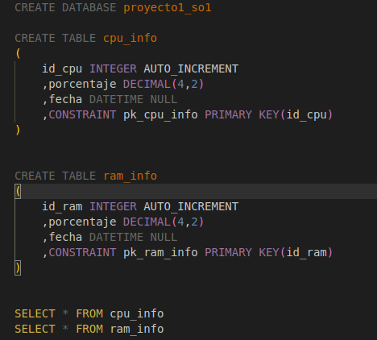

En el cual se crea la base, dos tablas para el monitoreo de ram y cpu

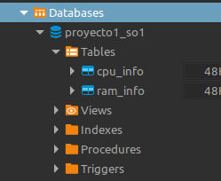

## Módulos Kernel
Se crearon dos módulos de kernel para obtener información de procesos y porcentajes de uso tanto de la RAM como del CPU.

### RAM
Importación de cabeceras o librerías necesarias

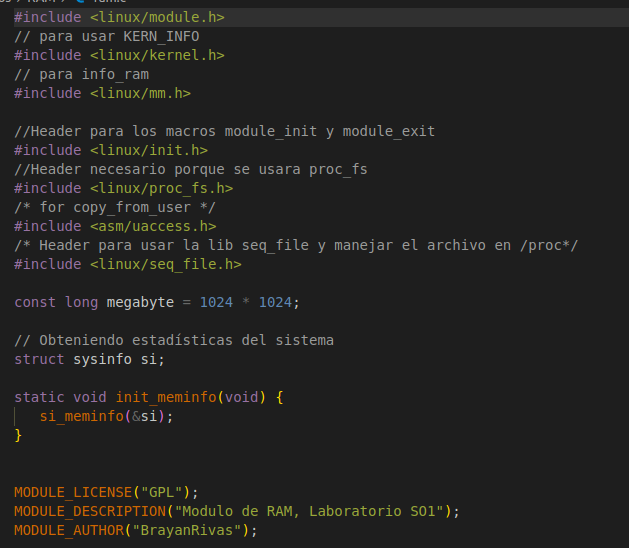

Se devuelve un json con la información

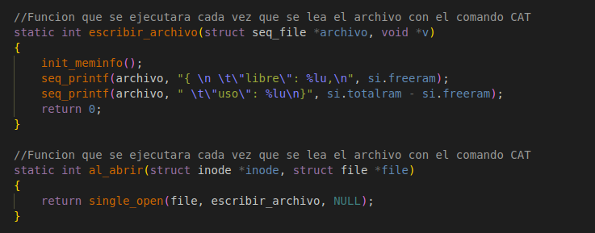

Finalmente se crea el archivo con la información obtenida

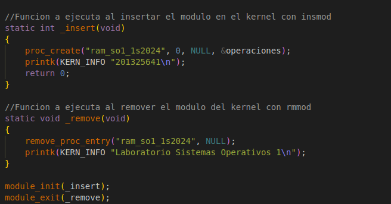

### CPU
Importación de cabeceras o librerías necesarias

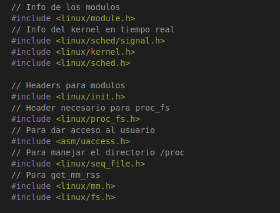

Se obtienen los procesos y se forma el json a devolver

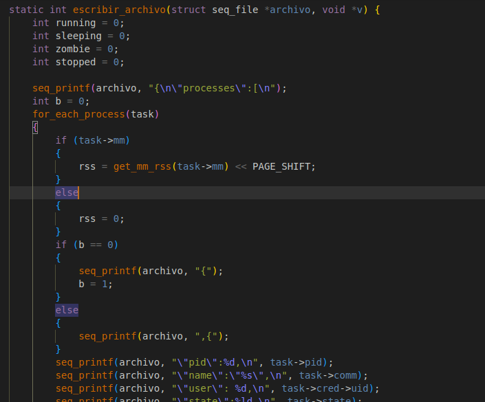

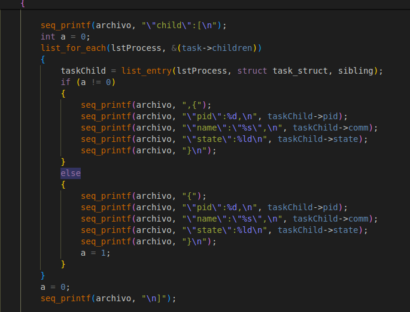

Finalmente se crea el archivo con la información obtenida

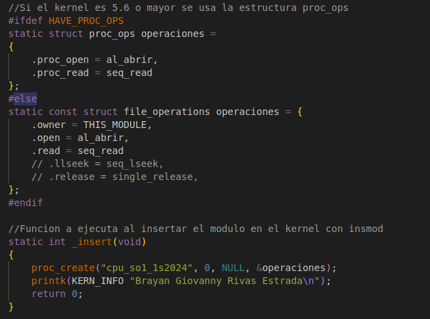

## Golang
Se realiza la conexión a la BD

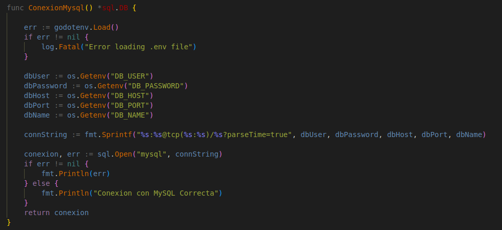

Para insertar la información en la BD, se ejecuta el comando

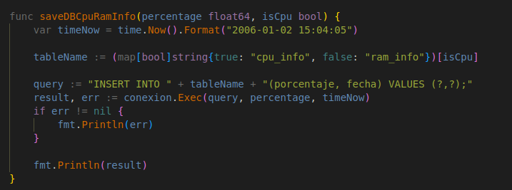

Para obtener el histórico, se realiza un select a las tablas

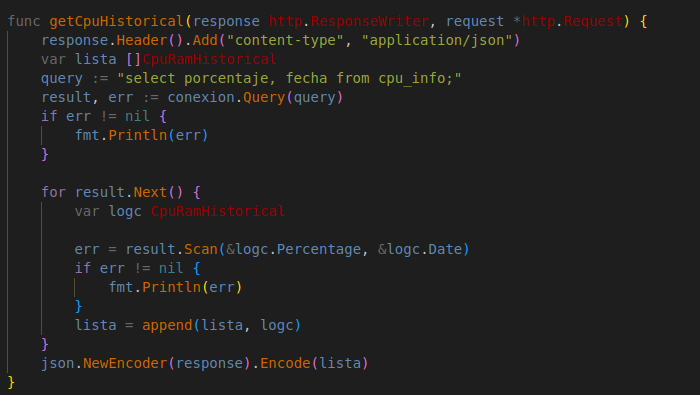

Para leer la información de los módulos, se ejecuta el comando cat de la siguiente manera

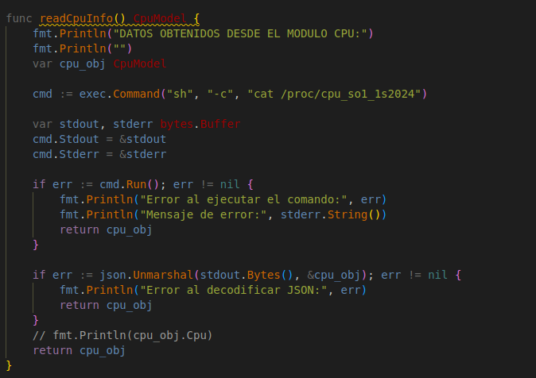

Toda la información la vamos a serializar en JSON para la comunicación con el frontend

Se tiene una rutina ejecutándose cada 10 segundos que se encarga de almacenar la información en la BD para el monitoreo histórico

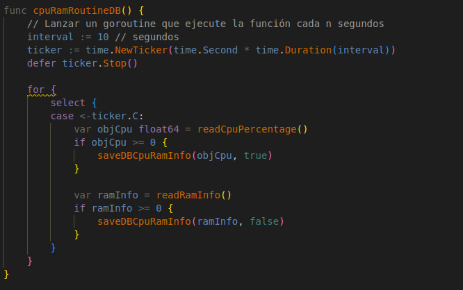

Finalmente tenemos nuestras rutas y la llamada a la rutina antes mencionada

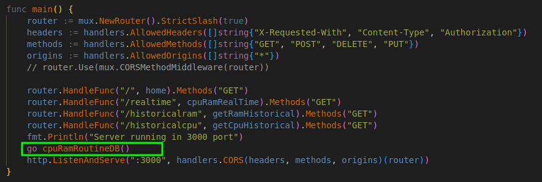

## FrontEnd
Una vez iniciada la aplicación, nos mostrará de inicio el monitoreo en tiempo real. Este monitoreo se muestra con una gráficas de Pie indicando el porcentaje de Uso y Libre, tanto de la RAM como del CPU

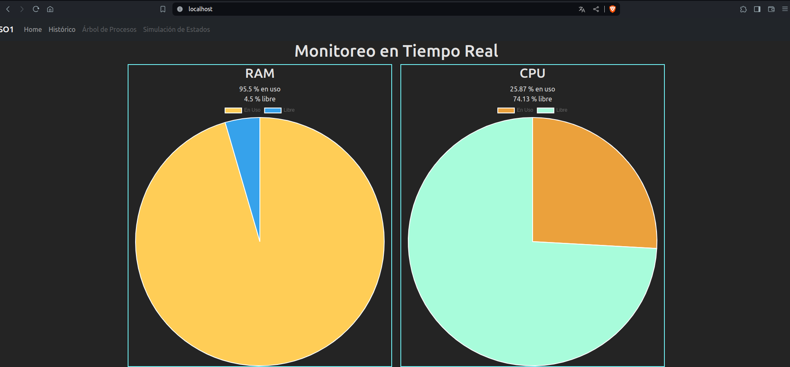

En el caso del monitoreo histórico, nos muestra unas gráficas de líneas con la fecha y porcentaje en cada eje.

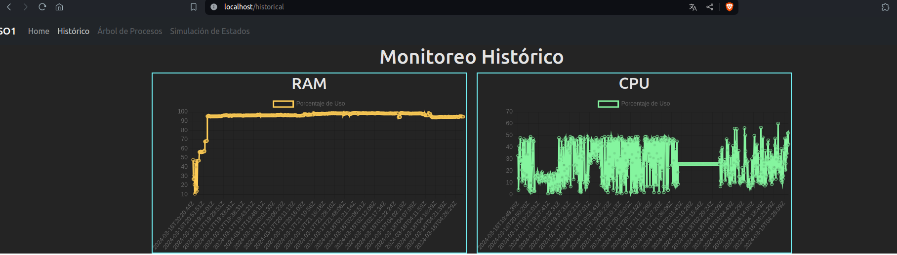

