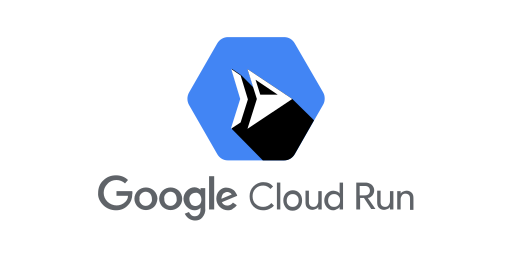

# Proyecto 2

## Introducción
Un sistema de votaciones es una herramienta que nos permite recopilar y contabilizar opiniones de un grupo de personas, esto con el fin de llegar a una conclusión o tomar decisiones. Estos datos se pueden capturar de forma ordenada y justa, lo cual garantiza que cada opinión sea tomada en cuenta.  

En esta ocasión, se desarrolló un sistema de votaciones para un concurso de bandas, en este caso serán bandas Guatemaltecas, dichas votaciones se obtienen de un generador de tráfico que encolará la información a través de servicios desarrollados los cuales tendrán consumidores a la escucha de estas colas. Los resultados en tiempo real serán mostrados en Dashboards, así como sus logs en una aplicación web.

## Objetivos
- Encolar los datos enviados hacia los servicios mediante un generador de tráfico.
- Almacenar y permitir la consulta de los distintos logs generados.
- Enviar datos desde un consumidor hacia una base de datos.

## Tecnologías Utilizadas
### Locust
Es un generador de tráfico el cual envía datos a los servidores desplegados en Kubernetes.

### GRPC
Framework de código abierto desarrollado por Google que facilita la comunicación entre diferentes servicios en un entorno distribuido. Utiliza el Protocolo de Buffers de Google (Protocol Buffers o protobuf) como su método de serialización de datos.

### Kubernetes
Es una plataforma de código abierto diseñada para automatizar, desplegar, escalar y gestionar aplicaciones en contenedores de manera eficiente y fácilmente escalable. Puede gestionar de forma centralizada contenedores Docker en entornos de producción, permitiendo administrar recursos, distribuir el tráfico de red, y garantizar la disponibilidad y el rendimiento de las aplicaciones de manera automatizada y sin interrupciones.

### Kafka
Kafka en Kubernetes combina la potencia de Apache Kafka, la cual es una plataforma de streaming de eventos, con la flexibilidad y la escalabilidad de Kubernetes. Permite desplegar y gestionar clústeres de Kafka de forma eficiente en entornos de Kubernetes, facilitando la construcción de arquitecturas de datos distribuidas y la gestión de flujos de datos en tiempo real.

### Redis
Es una base de datos en memoria de código abierto y de alto rendimiento. Se utiliza comúnmente como almacén de datos en caché, pero también es adecuado para una amplia gama de casos de uso, como colas de mensajes, almacenamiento de sesiones, análisis en tiempo real, etc.

### MongoDB
Es una base de datos NoSQL de código abierto, altamente escalable y orientada a documentos. Utiliza un modelo de datos flexible basado en documentos JSON, lo que permite almacenar y consultar datos de forma dinámica sin necesidad de un esquema rígido. Es conocido por su capacidad para gestionar grandes volúmenes de datos de manera eficiente y su capacidad de escalar horizontalmente en clústeres distribuidos.

### Grafana
Es una plataforma de análisis y visualización de datos de código abierto que permite monitorear y analizar métricas y registros en tiempo real. Es altamente personalizable y compatible con una amplia variedad de fuentes de datos, como bases de datos de series temporales, bases de datos relacionales, sistemas de monitorización, etc.

### Cloud Run
Es un servicio de Google Cloud que permite ejecutar contenedores de forma completamente administrada y sin servidores. Permite implementar aplicaciones en contenedores de manera rápida y sencilla, proporcionando escalabilidad automática, alta disponibilidad y facturación por uso. Es ideal para desarrollar aplicaciones sin preocuparse por la infraestructura subyacente, ya que permite ejecutar código en contenedores sin necesidad de gestionar servidores o escalar manualmente.

## Deployments y Services de K8S
### Deployments
Se crearon varios deployments, los cuales están separados por cada sección o tecnología utilizada.

En cada deployment se tienen varias secciones, pero entre las importantes están:
- Kind: Se indica la clase del manifiesto, en este caso es de tipo Deployment. 
- Namespace: El cual nos servirá para que todo lo que se despliegue se encuentre en un ambiente aislado dentro del clúster de kubernetes.
- Containers: En esta sección se indica la imagen de docker de la cual se hará un pull para poder crear nuestro pod. Dentro de esta sección se pueden setear las variables de entorno que son necesarias para nuestro contenedor. Regularmente estas variables se encuentran en un manifiesto aparte de tipo secret.

En ocasiones dentro de un mismo deployment se puede indicar que se utilizarán dos contenedores dentro de un mismo pod, ya que se necesitan comunicarse entre sí.

Otra sección que se pude incluir en un Deployment es la llamada a config maps

### Services
En cuanto a los services indican la una política para acceder a nuestros pods, en este caso se creó un manifiesto de tipo servicio por cada deployment o pod.

Entre las secciones importantes de los manifiestos de servicios están:

- Kind: Se indica la clase del manifiesto, en este caso es de tipo Service.
- Namespace: El cual nos servirá para que todo lo que se despliegue se encuentre en un ambiente aislado dentro del clúster de kubernetes.
- Selector: Se indica el nombre de nuestro despliegue al cual pertenece.
- Type: El cuál nos indicar cómo se expondrá el servicio fuera del clúster. En este caso se utilizaron varios tipos:
    - ClusterIP: El cual indica que el service solamente es accesible desde dentro del clúster.
    - NodePort: Asigna un puerto estático en cada nodo del clúster y reenvía el tráfico del puerto especificado al Pod asociado al service.
    - LoadBalancer: El cual expone el service fuera del clúster.

## Funcionamiento
Desde Locust se enviará tráfico a nuestros servicios, enviando un json, por la ruta en este caso de GRPC

Si todo es correcto se empieza a procesar la lectura del archivo, en el cual podemos monitorear si en dado caso algún item del arreglo del json no fue enviado correctamente, así como la cantidad de envíos exitosos.

En nuestra aplicación web, podemos ver los logs, que en este caso muestra la fecha, hora y registro enviado a nuestros servicios.

Desde Grafana podemos visualizar un dashboard con algunas gráficas que nos indican la cantidad de votos por banda, por álbum y el promedio del Ranking enviado para cada álbum.

En cuanto a los servicios, se tiene el siguiente resultado de nuestro procesamiento en las consolas del producer y consumer

#### Producer

#### Consumer

### Comparación de ejecución GRPC y Rust
En base al promedio de procesamiento del archivo JSON desde locust, se puede decir que el servicio GRPC es el que tardó menos, ya que tiene un promedio menor con la misma cantidad de datos a comparación de la API de Rust.

#### GRPC

#### Rust

## Conclusiones
- Grafana nos permite crear dashboards de manera sencilla y rápida, la cual es una herramienta muy útil que nos posibilita mostrar estadísticas o estado de algún proyecto en números y gráficas.
- Locust es una herramienta útil para poder testear nuestros servicios.
- Kubernetes puede llegar a tener una curva de aprendizaje alta, pero es una tecnología que vale la pena aprender.

